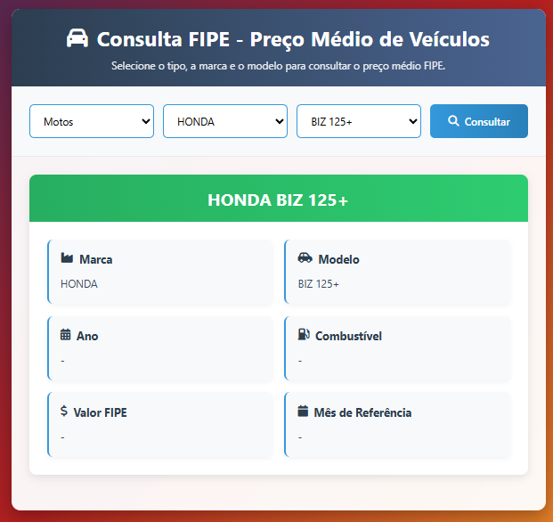

# 🚗 Consulta FIPE — Preço Médio de Veículos

Aplicação web moderna para consultar o **preço médio de veículos** na Tabela FIPE.  
O usuário pode selecionar o tipo de veículo (**carros, motos ou caminhões**), escolher a marca, modelo e consultar os detalhes completos, incluindo valor médio FIPE, combustível, ano do modelo e mês de referência.

---

## ✨ Funcionalidades

- 🔍 Consulta em tempo real dos valores da Tabela FIPE  
- 🚘 Suporte a **carros, motos e caminhões**  
- 🏭 Seleção dinâmica de **marca** e **modelo**  
- 📊 Exibição clara e organizada dos resultados:  
  - Marca  
  - Modelo  
  - Ano  
  - Combustível  
  - Valor médio FIPE  
  - Mês de referência  
- ⚡ Interface rápida, intuitiva e responsiva  

---

## 🚀 Tecnologias Utilizadas

- **HTML5** → Estrutura semântica da aplicação  
- **CSS3** → Estilização moderna e responsiva  
- **JavaScript (ES6)** → Consumo da API e exibição dinâmica dos resultados  
- **Font Awesome** → Ícones elegantes para melhor usabilidade  
- **[BrasilAPI - FIPE](https://brasilapi.com.br/docs#tag/FIPE)** → Fonte oficial dos dados  

---

## 📂 Estrutura do Projeto
```
├── index.html # Estrutura principal
├── css/
│ └── style.css # Estilos e layout responsivo
├── js/
│ └── consulta.js # Lógica de consulta à API e exibição dos dados

```

---

## ⚡ Como Usar Localmente

1. Clone este repositório:
   ```bash
   git clone https://github.com/ReiBrito/Consulta-FIPE.git
   ```
Acesse a pasta do projeto:

```bash
  cd Consulta-FIPE
```
Abra o arquivo index.html no navegador:

```bash
  start index.html   # Windows
  open index.html    # Mac
  xdg-open index.html # Linux
```
Escolha o tipo de veículo, selecione a marca, o modelo e clique em Consultar para visualizar os detalhes.

## 🌐 Demonstração

O GitHub Pages irá gerar o link:

👉 https://ReiBrito.github.io/consulta-veiculos-brasilapi/

## 🖼️ Imagem



## 📌 Melhorias Futuras

📱 Versão PWA para uso offline

📝 Histórico de consultas salvas no navegador

📤 Exportar os resultados em PDF ou Excel

📊 Comparação de valores entre diferentes modelos

## 👨‍💻 Autor

Desenvolvido por Reinaldo Brito 💙
Sinta-se livre para contribuir, sugerir melhorias ou adaptar ao seu uso!
